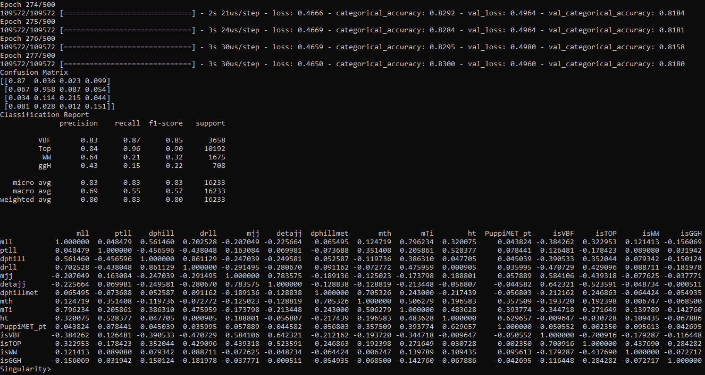

Deep neural network (DNN) that reads `v9` Monte Carlo files to separate the VBF, top, WW, and ggH processes.

# 0. Documentation

* [The Keras Sequential model](https://keras.io/guides/sequential_model/)

# 1. Installation

Log in to the CERN LXPLUS cluster.

    ssh -Y -l <user> lxplus.cern.ch -o ServerAliveInterval=240

The code has to be run with an el7 image. Follow the [El7 image with condor support for lxplus](https://gitlab.cern.ch/cms-cat/cmssw-lxplus/) instructions to create a `start_el7.sh` script, and then make it executable.

    chmod u+x start_el7.sh

Now you can run it.

    ./start_el7.sh

Initialize a CMSSW release.

    unset SCRAM_ARCH
    cmsrel CMSSW_10_6_0
    cd CMSSW_10_6_0/src
    cmsenv

Get the necessary files to run the DNN.

    mkdir $CMSSW_BASE/src/DNN
    cd $CMSSW_BASE/src/DNN
    
    wget https://raw.githubusercontent.com/piedraj/TFG/refs/heads/main/DNN/loader.py
    wget https://raw.githubusercontent.com/piedraj/TFG/refs/heads/main/DNN/keras_test.py

# 2. Always do

Everytime you start a new session you need to follow these steps.

    ssh -Y -l <user> lxplus.cern.ch -o ServerAliveInterval=240
    ./start_el7.sh
    cd CMSSW_10_6_0/src/
    cmsenv

# 3. Run the DNN

    cd $CMSSW_BASE/src/DNN
    python -b keras_test.py

You should obtain the results below.

